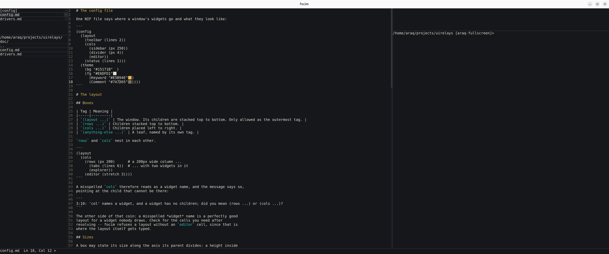

# focim

**focim** -- the Focussed Nim Editor. A code editor for focussed development,
highly opinionated: everything in the window is a text field, and the window
itself is one of them.



Tabs 0 and 1 are `[config]` and `[layout]`, and their text *is* the editor:
the `(theme ...)` that colors the widgets, and the `(layout ...)` that places
them. Editing one recolors the window on the next frame and editing the other
relayouts it, so there is no settings dialog. A lane that does not parse is
reported in the status bar with the line and column of the mistake and then
ignored, so the last good one keeps the window usable. Three configs ship with
it -- `theme` in the prompt lists them, `theme paper` puts one in the tab --
and a config that had been edited is written to a backup file first, since a
theme is that whole lane and not a coat of paint. The layout is a lane of its
own precisely so that picking a theme cannot cost you the shape of your
window -- and because it is the one the mouse writes: the gaps between the
panels are grips, and dragging one rewrites the sizes in `layout.nif`, in the
units they were written in.

The window is not one editor and one terminal either. Put the pointer in a
panel and it offers two buttons that make another one beside or below it, and
an `x` that takes it away again -- and all three do their work by editing
`layout.nif`, so a panel is undone with `Ctrl+Z` in the tab that holds it and
conjured by typing `(editor2)` into the file. Two editor panels may show the
same buffer at different lines, which makes editing one file as convenient as
editing two: they share the text, the undo history and the search hits, and
keep their own caret and their own view of it.

The same idea runs through the rest of it. There is no tab bar and no tree
view: the list of open tabs is an edit field whose lines are the tabs, so
deleting a line closes one, moving a line reorders them and `Ctrl+Z` reopens
the one just closed. The explorer is an edit field whose *first* line is the
path and the filter at once, so there is no open-file dialog either. Commands
are typed into the terminal or the status bar, and some of them act on the
buffer rather than on the machine.

## Download

The current release is **0.8.4**. Extract the archive and run `focim`,
optionally with a file to open.

| Platform | Download |
| --- | --- |
| Linux x86\_64 | [focim-0.8.4-linux\_amd64.tar.xz](https://github.com/Araq/focim/releases/download/v0.8.4/focim-0.8.4-linux_amd64.tar.xz) |
| Linux ARM64 | [focim-0.8.4-linux\_arm64.tar.xz](https://github.com/Araq/focim/releases/download/v0.8.4/focim-0.8.4-linux_arm64.tar.xz) |
| macOS ARM64 | [focim-0.8.4-macos\_arm64.tar.xz](https://github.com/Araq/focim/releases/download/v0.8.4/focim-0.8.4-macos_arm64.tar.xz) |
| Windows x86\_64 | [focim-0.8.4-windows\_amd64.zip](https://github.com/Araq/focim/releases/download/v0.8.4/focim-0.8.4-windows_amd64.zip) |

Those four name the version they are, so they go on working once there is a
newer one; [Releases](https://github.com/Araq/focim/releases) is where the
newest always is. What puts it there is
[`release.yml`](.github/workflows/release.yml), which builds a tag and nothing
else -- one release per version rather than one per commit. To build the
current source instead, see [Building](#building) below.

Every archive carries the editor's icon in the form its desktop wants: the
Windows `.exe` has it as a resource, the macOS archive holds `focim.app`
alongside the bare binary, and the Linux one has the hicolor PNGs and a
`.desktop` entry that `./install.sh` puts in the menu, pointing at wherever
the archive was extracted. All three are made by
[iconbundler](https://github.com/Araq/iconbundler) out of the one
`src/focim-icon.png`.

On Linux the binary links only libc: X11 is loaded at runtime, so
`libX11.so.6` and `libXft.so.2` have to be installed (`apt install libx11-6
libxft2`) along with at least one font fontconfig can find. macOS and Windows
need nothing.

## Building

focim is written with [uirelays](https://github.com/nim-lang/uirelays), which
gives it a window, a font and a mouse through the native API of each platform
-- WinAPI, Cocoa or X11, none of which needs a development package installed
to compile against. Neither it nor
[iconbundler](https://github.com/Araq/iconbundler), which makes the icons, is
on the Nimble package list yet, hence the URLs in `focim.nimble`:

```sh
nimble build            # or: nim c -d:release --outdir:. src/focim.nim
./focim

nimble bundle           # ... and put this build in the desktop's menu
nimble icons            # remake src/focim.{ico,rc,res} and the .netwm blob
                        # from src/focim-icon.png, after editing the art
```

`nimble icons` is the only step that needs ImageMagick (or a Python with
Pillow), and it is not part of a build: what it writes is checked in, since a
compiler reads three of those four files and two image tools do not resample a
PNG to the same bytes.

`Ctrl+Space` completes out of a vocabulary the binary carries: the words in
`data/nimony.txt` are compiled in, the way the icon is, so it is there however
the editor was installed. `tools/mkwordlist.nim` is what writes that file, out
of a checkout of the library it is a vocabulary of.

## What it does

| | |
|---|---|
| [The config file](doc/config.md) | The layout and the theme, as the text of tab 0 |
| [Opening a file](doc/open.md) | `o synedit` finds `src/focim/synedit.nim` from anywhere in the project |
| [Completion](doc/completion.md) | `Ctrl+Space` offers the words that exist -- no compiler in the loop |
| [Tracking](doc/track.md) | `Ctrl+click` asks one: where a name is declared, and everywhere it is used |
| [Search and replace](doc/search.md) | `find`, `next`, `replaceall` -- no dialog, every match highlighted in place |
| [The clipboard panel](doc/clipboard.md) | The last thirty texts that entered the clipboard, `Ctrl+1` .. `Ctrl+9` to paste one |

The long version is the comment at the top of
[`src/focim.nim`](src/focim.nim), which is where the design notes live.

## Tests

```sh
nimble test             # or: nim c -r tests/tester.nim
```

Every test is a program that needs no window: the drawing path is watched
through stub relays, so what is checked is what the editor decided rather than
what a driver painted. The last step builds the editor itself.

## History

focim grew inside [uirelays](https://github.com/nim-lang/uirelays) as
`apps/focim.nim` plus most of what sat in `src/widgets/` -- of which only a
handful were widgets. It moved here with its commits; the paths were renamed
on the way, so `git log --follow` on a file still reaches back to the day it
was written.

## License

MIT
